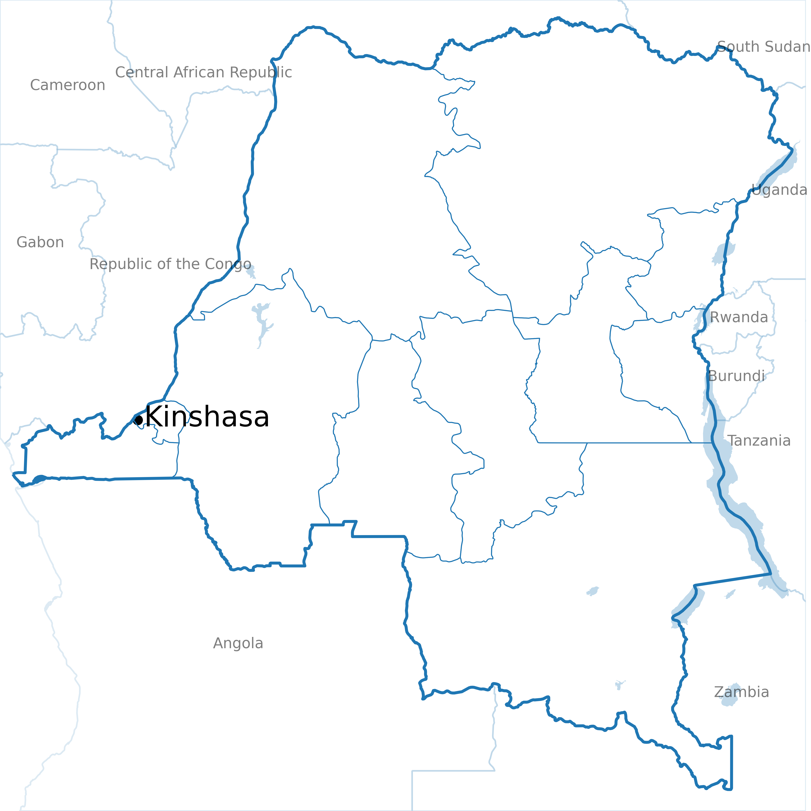

# DRCcode

This project studies **sexual violence in the Democratic Republic of the Congo (DRC)** and how it relates to **conflict exposure** and **climate/drought conditions**.

- [DHS recode manual](https://dhsprogram.com/pubs/pdf/DHSG4/Recode7_DHS_10Sep2018_DHSG4.pdf#page=90)
- [DRC final report 2023–2024](https://dhsprogram.com/pubs/pdf/FR393/FR393.pdf)

## Study Area (Small Preview)

<p align="center">
  
</p>

## Place Missing Files in `DATA/`

Put missing raw files into the folders below (keep these relative paths):

You can download the data from [DHS](https://dhsprogram.com/data/new-user-registration.cfm), [Uppsala / UCDP GED](https://ucdp.uu.se/downloads/), [ACLED](https://acleddata.com/faq/how-can-i-access-and-use-acled-data), and [SPEI](https://spei.csic.es/).

```text
DATA/
  DHS/
    CDIR81FL/                         # DHS IR files (raw)
    CDGE81FL/                         # DHS GPS shapefile (raw)
  Drought/
    spei01/spei01.nc                  # raw climate/drought NetCDF
  Conflict/
    Africa_lagged_data_up_to-2024-10-17/
      Africa_lagged_data_up_to-2024-10-17.xlsx   # ACLED
    Uppsala/
      GEDEvent_v25_1.csv              # UCDP GED / Uppsala
```

Then generate/refresh derived files:

```bash
python DATA/DHS/convert.py
python DATA/Drought/convert.py
```

This will (re)create key analysis tables such as:
- `DATA/DHS/women_all_answers_gps.csv`
- `DATA/Drought/DRC_spei01_clean.csv`

You can then run the desired analysis scripts directly from the `src/` folder (for example: `python src/h01_heatmap.py`).

## Python Scripts in `src/`

- `00_add_rows_of_interest.py`: Adds row-wise derived violence indicators to `women_all_answers_gps.csv`.
- `00_generate_background_image.py`: Downloads and assembles an OpenStreetMap-based DRC background image.
- `00_generate_background_image_naturalEarth.py`: Builds a Natural Earth-based DRC background map image.
- `01a_vis_dhs_maps.py`: Creates cluster-level DHS violence prevalence maps for selected indicators.
- `01b_vis_dhs_scatter.py`: Creates a cluster-level correlation scatter plot for two DHS indicators.
- `02a_IPV_overview_fig.py`: Generates generalized cluster-level prevalence maps for configurable DHS variables.
- `02c_decision_tree.py`: Trains a decision tree model to predict extreme disadvantage from DHS variables.
- `02d_summary_statistics.py`: Produces broad summary statistics and frequency-style outputs for DHS variables.
- `02e_correlated_rows.py`: Finds strongly correlated DHS columns and writes a text summary.
- `03_compare_uppsala_acled.py`: Compares ACLED and Uppsala conflict maps across years.
- `h01_heatmap.py`: Creates wealth-by-education heatmaps for violence indicators.
- `h09_conflict_vs_ipv.py`: Analyzes IPV versus distance to nearby conflict events.
- `h09b_conflict_visuals.py`: Visualizes conflict events in and around the DRC.
- `h10a_visuals.py`: Maps drought intensity / drought-month exposure from SPEI data.
- `h10b_drought_vs_conflict.py`: Compares drought exposure classes with recent violence indicators.

## Python Environment with `uv` (Optional but Recommended)

Create and activate a local environment:

```bash
uv venv drcenv
source drcenv/bin/activate
```

Install core packages used across scripts:

```bash
uv pip install pandas numpy matplotlib seaborn scipy requests pillow openpyxl geopandas shapely xarray netCDF4 pyyaml
```

Run Python scripts with this environment in one of these two ways:

```bash
source drcenv/bin/activate
python src/h01_heatmap.py
```

or directly through `uv` without manually activating the environment:

```bash
uv run python src/h01_heatmap.py
```

You can replace `src/h01_heatmap.py` with any other script from `src/`.

If you want a pinned requirements file:

```bash
uv pip freeze > requirements.txt
```

Later, to sync exactly to that file:

```bash
uv pip sync requirements.txt
```

## Overview DHS Variables

DHS mixes **(a)** identifiers/survey logistics, **(b)** household background, **(c)** women’s module, and **(d)** child/birth-history “roster” blocks that repeat per child/pregnancy.

Here’s a **short clustering** you can use (with the main prefixes you have in your list):

**1) IDs, sampling, weights, fieldwork meta**
**Purpose:** identify record + design variables for weighted/clustered analysis.  
**Vars:** `CASEID`, `V000–V005`, `V001–V004`, `V021–V023`, `V005/ D005`, `V027–V032`, `V047–V048`, interview timing `V006–V019A`, `V801–V806`, selection flags `V042/V044`.

**2) Geography & residence / mobility**
**Purpose:** where respondent lives, rural/urban, migration.  
**Vars:** `V024–V026`, `V101–V105A`, `V103–V104`, `V139–V141`, `V172–V176`, `V174M/V174Y`, `V175`, `V040`.

**3) Household socioeconomic status & living conditions**
**Purpose:** wealth proxies + infrastructure.  
**Vars:** water/sanitation `V113/V115/V116/V160`, assets `V119–V125/V153/V169A–V171B`, housing materials `V127–V129`, cooking fuel `V161`, household composition `V135–V138`, wealth index `V190–V191A`, plus “all woman factors” `AWFACT*`.

**4) Demographics & education / media exposure**
**Purpose:** basic respondent profile + information access.  
**Vars:** DOB/age `V009–V014`, education `V106–V107/V133/V149`, literacy/media `V155–V159`, religion/ethnicity `V130/V131`.

**5) Fertility history (summary counts) + pregnancy status**
**Purpose:** how many births, living/dead children, current pregnancy.  
**Vars:** `V201–V220`, `V211–V213`, `V214–V227`, terminations `V228–V246`, pregnancy wantedness `V225`, menstrual hygiene items `V247*–V249`.

**6) Contraception & family planning knowledge / sources / reasons**
**Purpose:** FP outcomes + program exposure + reasons for nonuse.  
**Vars:** `V301–V327`, `V359–V367A`, FP media `V384A–V384I`, contacts `V393–V395`, counseling `V3A02–V3A06`, reasons `V3A08*`, EC/injectables `V3A11–V3A14`, plus big “source for non-users” block `V3A00*`.

**7) Maternal care (ANC, delivery, postnatal) + newborn care**
**Purpose:** maternal health service use and quality indicators.  
**Vars:** tetanus `M1*`, ANC providers `M2*`, delivery assistance `M3*`, ANC timing/visits `M13–M15`, delivery `M15/M17`, supplements/malaria `M45–M49*`, facility types `M57*`, postnatal checks `M60–M77A`, immediate newborn practices `MNB*`, respectful care block `MH*`.

**8) Child feeding & nutrition (for youngest/roster child)**
**Purpose:** liquids/foods yesterday, stool disposal, advice.  
**Vars:** `V409–V414*`, `V465`, `V469*`, `V486`, and women diet recall `V471*–V472*`.

**9) Child vaccination & illness care**
**Purpose:** immunization dates + recent diarrhea/fever/cough + treatment sources.  
**Vars:** vaccination roster `H1–H69` (and date splits `*D/*M/*Y`), illness & care-seeking `H11–H47`, malaria meds `H37*`, growth monitoring `H70*`.

**10) Anthropometrics & biomarkers**
**Purpose:** measured health outcomes.  
**Vars:** child anthro & anemia `HW*`, women anthro/anemia `V437–V458`, hemoglobin selection/consent `V042/V452*`.

**11) Marriage/sexual activity, gender norms, empowerment, work**
**Purpose:** union history, sex timing, decision-making, attitudes.  
**Vars:** marriage/union `V501–V513`, sex timing/activity `V525–V538`, fertility preferences `V602–V629`, decision-making & norms `V632/V739/V743*`, wife beating norms `V744*`, assets/rights `V745*`, work `V714–V741`.

**12) HIV/STI knowledge, testing, partners, condoms**
**Purpose:** HIV outcomes + risk behavior.  
**Vars:** `V750–V867*`, partners `V766*–V768*`, condom use `V761–V763`, testing `V781–V865`, stigma/attitudes `V775–V859`.

**13) Domestic violence module**
**Purpose:** controlling behaviors, emotional/physical/sexual violence + help-seeking.  
**Vars:** `D100–D130*`, plus interruption/presence controls `V811–V815*`, DV weight `D005`.

**14) Chronic disease / mental health / special modules**
**Purpose:** non-communicable disease, mental health screening, fistula.  
**Vars:** `CHD*`, `MTH*`, `FI*`, plus country-specific `S*`, `SD/SM/SY*`.
